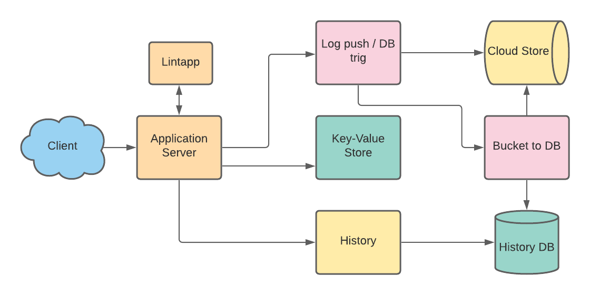

# pybin

### What is it
Pybin is a plain text paste bin for code snippets or working modules. Initially supporting
python but could be extended to other languages. To be used with proper code formatting on
any device (mobile or desktop) using standard linter interactively.
Application should be able to share data through simple user_id/url.
Will maintain 20 last snippets with simple URI to be used from multiple devices.

### Requirements
* Upload
  * LIFO (stack) for simple last snippet using user_id
* TTL scrubber for time or max number of snippets
* _(Compression)_

### Design considerations
Key-value store to be used to maintain snippet with data. Logs to create permanent storage in 
buckets that can be accessed through separate API (history), TTL for those will be one year.
  
The latest snippet will always be available with the simple URI+user_id on any device.
 
Microservices should use gRPC when possible. 
Prefer self balanced trees for k/v store. 

### Capacity planning
#### Capacity (+ memory req)
* Traffic Estimates
    1. 100k Snippets per day (100k / day ~= 1 snippets/sec )
    2. 8:1 read versus write (800k reads / day ~= 9 reads/sec )
* Rate limit based on user_id (10/sec write, 80 /sec read)  

#### Size limits
* Max 10M of snippet, 2M of description Max per user (10M+2M) * 20 = 240M
#### Speed limits
#### Bandwidth?

### API's
`addSnippet(api_dev_key,snip_desc,snip_data,user_id=None,snip_id=None,snip_ttl=12`

|type|name|default value|description|
|-----|-----|-----|-----|
|key|api_dev_key| |developer key to give response flexibility|
|text/snip_desc| |description of snippet|
|text|snip_data| |snippet to store|
|id|user_id|None|User unique ID|
|snippet id|snip_id|None|Snippet ID for the snippet|
|TTL|snip_ttl|12|Time to live for snippet in hours|

### K/V store

1. key user_id
2. dataobj (protobuf)

Needs to be redundant. Eventually consistent ok. 
Objects should support TTL.

### Database Design
Snip_id should be a hash to simplify partitioning.

### High level design
Service will require registration (google, facebook) 
Application will read and write requests. Logs get's sent to Cloud Store (ex. S3) and after
successful push trig an upload to history DB. 

    1. key for k/v store = user_id
    2. Contains counter for max items or 240MB size

### Component design
### App layer
Application server relies on k/v store to initiate or retrieve user baselevel information,
e.g. max(counter)/used id's/ so it can retrieve existing buffer and push on to the stack. 
Linter will be used and will not commit until user corrects errors. After success adding blob
to k/v store and sending off to log pipeline. Keys will be simple using user_id with incremented snip number.

### Partitioning
### Load balancer
### Metrics
Evaluate sumo-logic for postgres monitors etc. 
Prometheus 
### Cache

### Future
* Duplication detection of snippet MD5
* Find snippets in GitHub

[just util and fun stuff](./fun_util)