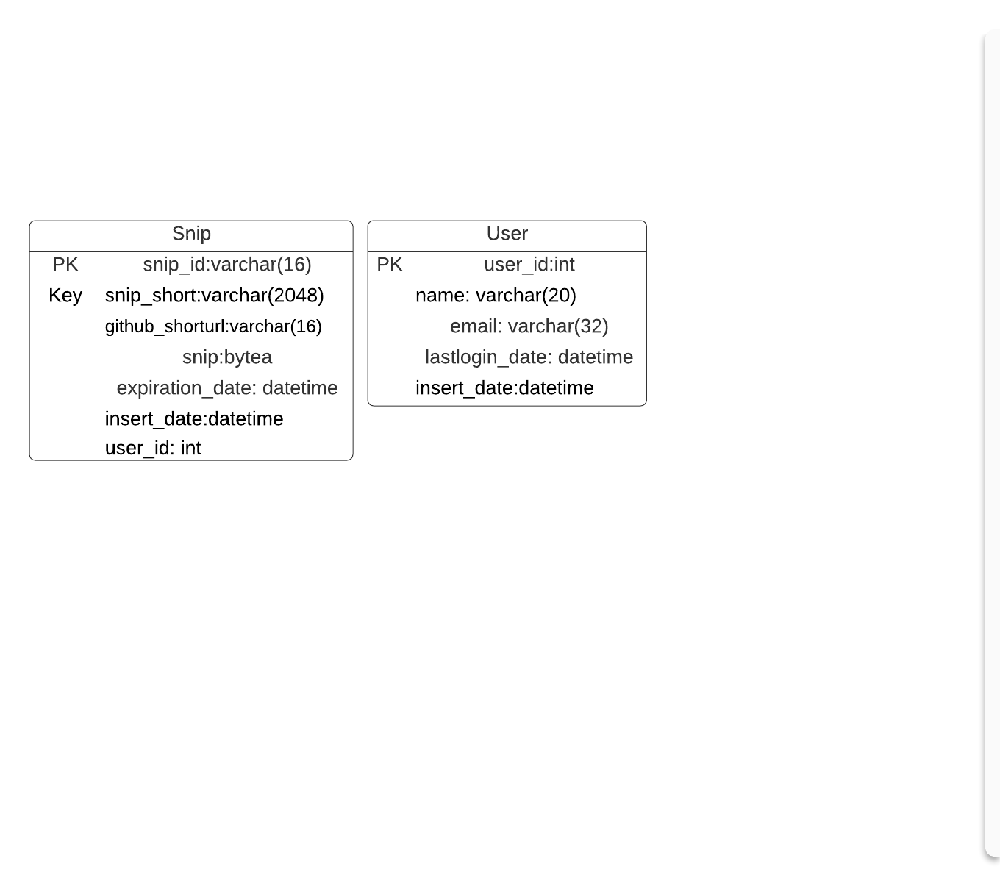
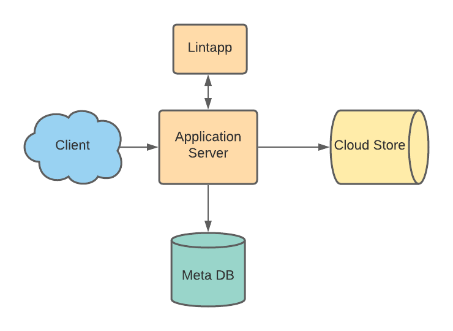

# pybin

### What is it
Pybin is a plain text paste bin for code snippets or working modules. Initially supporting
python but could be extended to other languages. To be used with proper code formatting on
any device (mobile or desktop) using standard linter interactively.

### Requirements
  * Upload gives url to access it
  * only text
  * TTL scrubber for time configurable
  * _(Compression)_?

### Design considerations
Key-value store to be used to maintain snippet location, metadata. 
 
Microservices should use gRPC when possible. 
Prefer self balanced trees for k/v store. 
Protobuf for de/serializing  

### Capacity planning
#### Capacity (+ memory req)
* 1 Million users
* Traffic Estimates
    1. 100k Snippets per day (100k / day ~= 1 snippets/sec )
    2. 8:1 read versus write (800k reads / day ~= 9 reads/sec )
  
#### Size limits
Snippets are not big so average 15 kilobyte
* 100k writes at 15 kilobytes = 1.5 GB / day = ~ .5 TB / year
* Max snip size 10MB

#### Speed limits
* Rate limit based on user_id (60/min write, 800 /min read)
   * Using sliding window with counters, normalized to minutes
      * requires 2 x 4 bytes for epoch time and 2 bytes for counter

### API's
`addSnippet(api_dev_key,snip_desc,snip_data,user_id=None,snip_id=None,snip_ttl=12`

|type|name|default value|description|
|-----|-----|-----|-----|
|key|api_dev_key| |developer key to give response flexibility|
|text/snip_desc| |description of snippet|
|text|snip_data| |snippet to store|
|id|user_id|None|User unique ID|
|snippet id|snip_id|None|Snippet ID for the snippet|
|TTL|snip_ttl|12|Time to live for snippet in hours|

### k/v store
Needs to be redundant. Eventually consistent ok. 
Objects should support TTL.

### Database Design
Snip_id should be a hash to simplify partitioning. 
_Using url-shortening we can store detected github url that contains duplicate._ 

### High level design
Service will require registration (google, facebook) 
Application will read and write requests. Logs get's sent to Cloud Store (ex. S3) and after
successful push trig an upload to history DB. 

### Component design

### App layer
Application server relies on k/v store for meta information, location of snip.
Linter will be used and will not commit until user corrects errors. After success adding blob
to k/v store and sending off to log pipeline. Keys will be simple using user_id with incremented snip number.

### URL shortening
* Base64, 6 letters ~ 68.7B possible strings
* snip_id, real_url, short_url

### Partitioning
k/v should have redundancy and partitioning built in.
### Load balancer
### Metrics
Evaluate sumo-logic for postgres monitors etc. 
Prometheus 
Datadog
### Cache
* _memcached_?
* _mcrouter_?

### Future
* Duplication detection of snippet MD5
* Find snippets in GitHub

[just util and fun stuff](./fun_util)